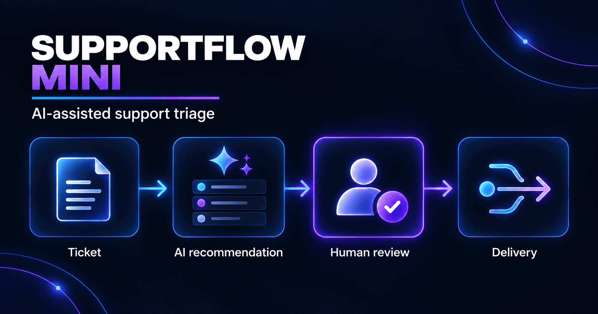

# SupportFlow Mini

One problem. One model call. One human decision. One safe integration.



## The customer problem

Northstar Labs has a small support team. Tickets arrive by email; a coordinator manually reads each one, decides urgency, and forwards it to a team. That takes about five minutes per ticket, routing is inconsistent, and nobody measures how often the first decision was correct.

SupportFlow Mini is a **portfolio prototype** of a safer loop:

**Submit → Recommend → Review → Deliver → Measure**

The system may recommend a route. A person remains accountable for the final decision. Webhook delivery is blocked until after human review.

## What it does

- Accepts a support ticket (customer, tier, subject, description)
- Returns a **typed** recommendation: category, priority, team, summary, draft response, confidence
- Requires **approve or correct** before anything leaves the system
- Stores the original AI/mock recommendation **separately** from the human decision (audit + agreement metrics)
- Optionally POSTs the **final** approved payload to one webhook
- Tracks schema validity, agreement rate, confidence, and delivery outcomes

## Stack

| Layer | Choice | Why |
| --- | --- | --- |
| API | FastAPI | Typed routes, validation, auto docs |
| Data | SQLite | Zero-ops storage for a single-user prototype |
| Schemas | Pydantic | Contract between probabilistic output and app code |
| AI | Mock first, then one structured LLM call | Prove the workflow before model uncertainty |
| UI | Static HTML/JS/CSS served by FastAPI | One process, no CORS ceremony |

Intentionally **out of scope**: RAG, agents, auth, queues, multi-tenant isolation, delivery retries.

## Quick start

Requires Python 3.11+.

```bash
python3.12 -m venv .venv
source .venv/bin/activate   # Windows: .venv\Scripts\Activate.ps1
python -m pip install -r requirements.txt
cp .env.example .env
uvicorn app:app --reload
```

Open:

- App (when UI is wired): http://127.0.0.1:8000
- Health: http://127.0.0.1:8000/api/health
- Interactive API docs: http://127.0.0.1:8000/docs

Starting config is mock mode (no API key required):

```env
AI_MODE=mock
OPENAI_API_KEY=
OPENAI_MODEL=gpt-5-mini
WEBHOOK_URL=
```

Secrets belong in `.env` only — never in client code or Git.

## Project layout

```
app.py              # API, schemas, DB, triage, review, webhook
static/             # Browser UI
tests/test_app.py   # Create → review → metrics
eval_cases.json     # Tiny evaluation set
evaluate.py         # Category / priority accuracy
public/             # README assets
```

## Safety invariant

```
AI proposes → Human decides → Store final → POST webhook → Record result
```

`deliver_ticket` runs only after a review event and final fields are stored. The UI is not the security boundary; the backend enforces order.

## Measurement

| Signal | Meaning |
| --- | --- |
| Schema validity | Every recommendation must pass the Pydantic model |
| Agreement rate | Approved unchanged ÷ reviewed tickets |
| Confidence | Reviewer hint — not automatic authority |
| Unsafe deliveries | Must stay **zero** (no webhook before review) |

```bash
pytest -q
python evaluate.py
```

## Status

In progress as an FDE fundamentals build: typed schemas, mock triage, health endpoint, and SQLite schema are in place. Human review UI, live structured model call, webhook delivery, eval harness, and packaging follow next.

## Limitations (intentional)

- SQLite is fine for a demo; it is not durable multi-user production storage without a persistent volume (or PostgreSQL).
- No authentication or tenant isolation yet.
- No webhook retry / idempotency queue yet — knowing that requirement is part of the exercise.

## License

Personal learning / portfolio project.
